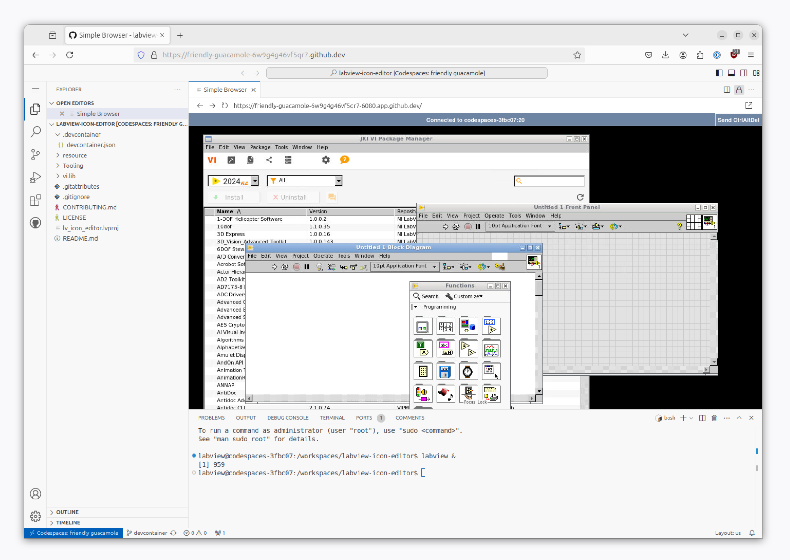

# Dev Container

This guide will help you set up a [Dev Container](https://marketplace.visualstudio.com/items?itemName=ms-vscode-remote.remote-containers) or [GitHub Codespace](https://marketplace.visualstudio.com/items?itemName=GitHub.codespaces) for working on your github-hosted, open source LabVIEW projects.

## Requirements

- **Non-commercial use only** (i.e. working on open source or home/hobby projects)
    - Use on public github repositories only
    - You must have a [LabVIEW Community Edition](https://www.ni.com/en/shop/labview/select-edition/labview-community-edition.html) license
    - You must have a [VIPM Community Edition](https://www.vipm.io/desktop/) license

## How to create a development container

Simply copy [devcontainer.json](./.devcontainer/devcontainer.json) into a folder to `.devcontainer/devcontainer.json` in your github project, and then follow the steps below.

You have two primary choices for running the devcontainer:

1) in the browser on via [GitHub Codespace](https://docs.github.com/en/codespaces/overview) (github hardware) or

2) locally as a devcontainer via docker

#### Option #1 GitHub Codespace (running on GitHub's servers)

- Requirements:
    - Web browser
    - An account with GitHub Codespace minutes -- THIS COSTS MONEY and will most likely result in fees/charges to your github account.
    - VSCode with [GitHub Codespaces extension](https://marketplace.visualstudio.com/items?itemName=GitHub.codespaces) installed (if connecting from VSCode app running locally, rather than in the browser)

- Steps:
    - Open to your github project's homepage in the browser, and then press the `.` (period) key to open VSCode in the browser
    - click on the  icon in the lower left and choose `Continue Working in New Codespace` and then choose the size of the codespace machine.

#### Option #2 Local Devcontainer (running on your own computer) on Docker

- Requirements:
    - Arch: Intel processor (Apple Silicon won't work)
    - OS: Linux or Windows + [WSL](https://docs.docker.com/desktop/wsl/)
    - SW:
        - [Docker](https://www.docker.com/) (or containerd might work)
        - [VSCode](https://code.visualstudio.com/)
        - [Dev Containers](https://marketplace.visualstudio.com/items?itemName=ms-vscode-remote.remote-containers) extension for VSCode

- Steps:
    - Open the project in VSCode on your computer
    - Click on the  icon in the lower left and choose `Open in Dev Container`

#### More Remote Options

If you know what you're doing, you can probably host your own [vscode server](https://github.com/coder/code-server) with devcontainers running on that same hosted code server. That's beyond the scope of this guide :)